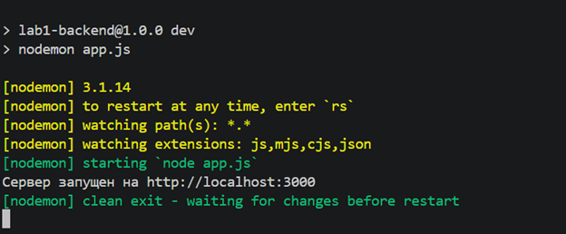
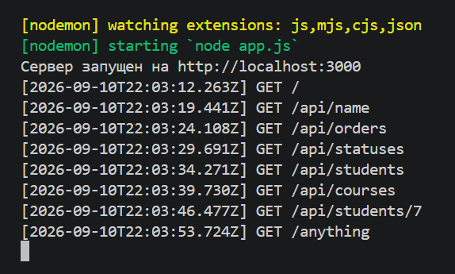
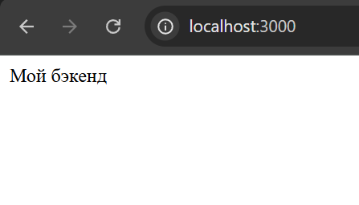
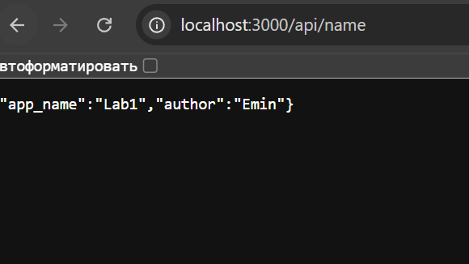
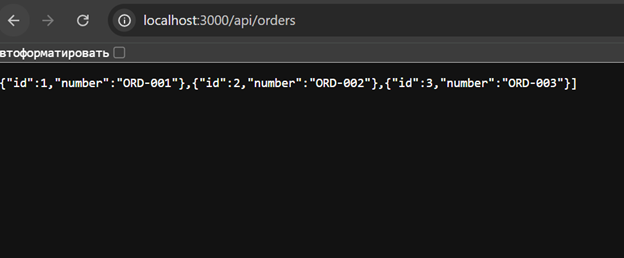
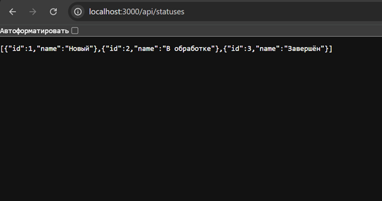
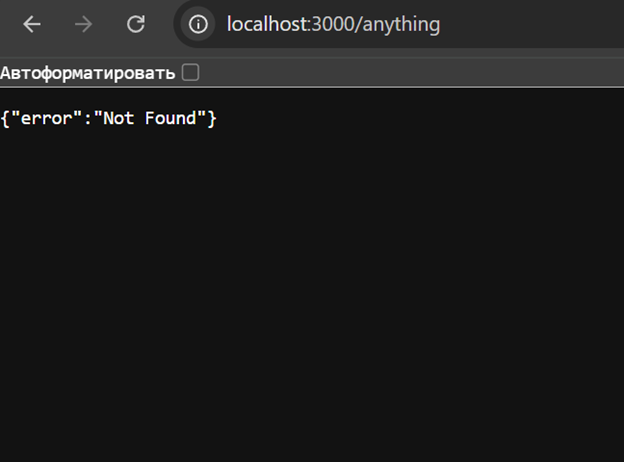
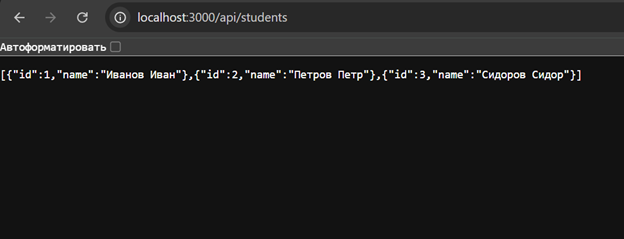
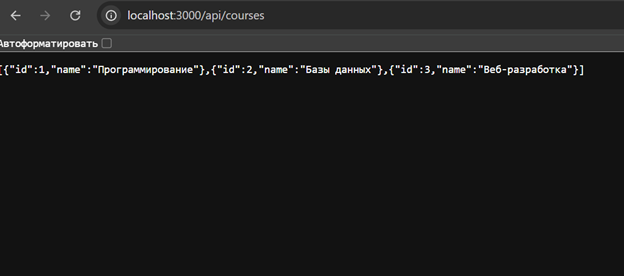
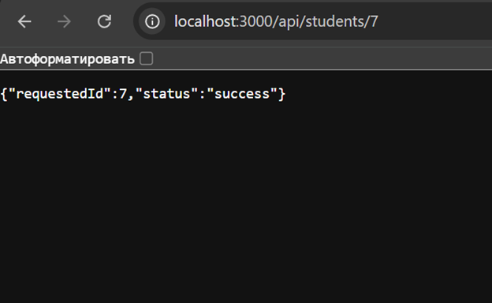

# Лабораторная работа №1. Настройка среды разработки и первый HTTP-сервер

**Студент:** Давлетмурзаев Сайд-Эмин Тимурович

**Группа:** ПИЖ-б-о-25-1

**Вариант:** 7

**Технология:** Node.js + Express

## 1. Цель работы

Освоить настройку среды разработки для backend-разработки, создать и запустить минимальный HTTP-сервер, реализовать обработку GET-запросов, работу с эндпоинтами и JSON-ответами, а также настроить автоматический перезапуск сервера при изменении исходного кода.

## 2. Теоретическое обоснование

Backend — серверная часть веб-приложения, которая отвечает за обработку запросов клиентов, выполнение серверной логики и формирование ответов. В клиент-серверной архитектуре клиент отправляет HTTP-запрос серверу, а сервер обрабатывает его и возвращает HTTP-ответ.

Endpoint — конкретный адрес URL вместе с HTTP-методом, по которому клиент обращается к серверу. В данной работе используется метод GET для получения данных. JSON представляет собой текстовый формат обмена структурированными данными.

Node.js позволяет выполнять JavaScript на стороне сервера. Express является веб-фреймворком для Node.js и упрощает создание HTTP-сервера и маршрутов. Для автоматического перезапуска сервера при изменении исходного кода используется Nodemon.

## 3. Выполнение практического примера

### 3.1. Создание проекта

Для выполнения лабораторной работы использовалась среда разработки Visual Studio Code.

Во встроенном терминале были выполнены следующие команды:

```bash
mkdir lab1-backend
cd lab1-backend
npm install express
npm install --save-dev nodemon
```

В результате был создан проект lab1-backend и установлены необходимые зависимости.

**Рисунок 1 — Создание проекта и установка зависимостей**



### 3.2. Настройка автоматического перезапуска

Для запуска сервера с помощью Nodemon в файле package.json был добавлен скрипт:

```json
"dev": "nodemon app.js"
```

Для запуска сервера используется команда:

```bash
npm run dev
```

После запуска сервер работает по адресу:

http://localhost:3000

**Рисунок 2 — Запуск сервера с помощью Nodemon**



## 4. Выполнение индивидуального задания

Для варианта 7 были выполнены задания базового, среднего и повышенного уровней.

### 4.1. Реализация сервера

Основной код сервера размещён в файле app.js.

```javascript
const express = require('express');

const app = express();

const port = 3000;

app.use((req, res, next) => {
    console.log(`[${new Date().toISOString()}] ${req.method} ${req.url}`);
    next();
});

app.get('/', (req, res) => {
    res.send('Мой бэкенд');
});

app.get('/api/name', (req, res) => {
    res.json({
        app_name: 'Lab1',
        author: 'Student'
    });
});

app.get('/api/orders', (req, res) => {
    res.json([
        { id: 1, number: 'ORD-001' },
        { id: 2, number: 'ORD-002' },
        { id: 3, number: 'ORD-003' }
    ]);
});

app.get('/api/statuses', (req, res) => {
    res.json([
        { id: 1, name: 'Новый' },
        { id: 2, name: 'В обработке' },
        { id: 3, name: 'Завершён' }
    ]);
});

app.get('/api/students', (req, res) => {
    res.json([
        { id: 1, name: 'Иванов Иван' },
        { id: 2, name: 'Петров Петр' },
        { id: 3, name: 'Сидоров Сидор' }
    ]);
});

app.get('/api/courses', (req, res) => {
    res.json([
        { id: 1, name: 'Программирование' },
        { id: 2, name: 'Базы данных' },
        { id: 3, name: 'Веб-разработка' }
    ]);
});

app.get('/api/students/:id', (req, res) => {
    res.json({
        requestedId: Number(req.params.id),
        status: 'success'
    });
});

app.use((req, res) => {
    res.status(404).json({
        error: 'Not Found'
    });
});

app.listen(port, () => {
    console.log(`Сервер запущен на http://localhost:${port}`);
});
```

## 5. Базовый уровень

Для варианта 7 базового уровня реализованы корневой текстовый endpoint и JSON-эндпоинт /api/name.

Корневой маршрут GET / возвращает текст:

Мой бэкенд

**Рисунок 3 — Проверка корневого маршрута**



Открыть в браузере:

http://localhost:3000

Эндпоинт /api/name возвращает JSON:

```json
{
  "app_name": "Lab1",
  "author": "Emin"
}
```

**Рисунок 4 — Проверка /api/name**



Открыть:

http://localhost:3000/api/name

## 6. Средний уровень

Для варианта 7 среднего уровня реализованы эндпоинты /api/orders и /api/statuses.

Эндпоинт /api/orders возвращает статический список заказов.

**Рисунок 5 — Проверка /api/orders**



Открыть:

http://localhost:3000/api/orders

Эндпоинт /api/statuses возвращает список статусов заказов.

**Рисунок 6 — Проверка /api/statuses**



Открыть:

http://localhost:3000/api/statuses

Для неизвестных маршрутов реализована обработка ошибки 404.

**Рисунок 7 — Проверка ошибки 404**



Открыть:

http://localhost:3000/anything

Результат:

```json
{
  "error": "Not Found"
}
```

## 7. Повышенный уровень

Для варианта 7 повышенного уровня реализованы две коллекции, параметризованный endpoint, обработка ошибки 404, автоматический перезапуск и консольное логирование запросов.

Эндпоинт /api/students возвращает список студентов.

**Рисунок 8 — Проверка /api/students**



Открыть:

http://localhost:3000/api/students

Эндпоинт /api/courses возвращает список курсов.

**Рисунок 9 — Проверка /api/courses**



Открыть:

http://localhost:3000/api/courses

Для работы с параметром ID реализован маршрут /api/students/:id.

При обращении к адресу:

http://localhost:3000/api/students/7

сервер возвращает:

```json
{
  "requestedId": 7,
  "status": "success"
}
```

**Рисунок 10 — Проверка маршрута**



Для консольного логирования используется middleware. Он выводит в терминал время запроса, HTTP-метод и URL.

На скриншоте запуска сервера (рисунок 2) видны выполненные запросы:

```text
GET /
GET /api/name
GET /api/orders
GET /api/statuses
GET /api/students
GET /api/courses
GET /api/students/7
GET /anything
```

## 8. Итоговая структура проекта

После выполнения лабораторной работы структура проекта имеет вид:

```text
lab1-backend/

├── node_modules/

├── screenshots/

├── app.js

├── package-lock.json

└── package.json
```

## 9. Ответы на контрольные вопросы

### 1. Что такое клиент-серверная архитектура?

Клиент-серверная архитектура — модель взаимодействия, при которой клиент отправляет запрос серверу, а сервер обрабатывает запрос и возвращает ответ.

### 2. Какой протокол используется для общения клиента и сервера в вебе?

Для общения клиента и сервера используется протокол HTTP.

### 3. Что такое endpoint?

Endpoint — конкретный адрес URL вместе с HTTP-методом, по которому клиент обращается к серверу.

### 4. Что такое JSON?

JSON — текстовый формат обмена структурированными данными, используемый для передачи информации между клиентом и сервером.

### 5. Что такое автоматический перезапуск сервера?

Автоматический перезапуск позволяет серверу самостоятельно перезапускаться после изменения исходного кода. В Node.js для этого используется Nodemon.

### 6. За что отвечает код состояния 404?

Код состояния HTTP 404 означает, что запрошенный маршрут или ресурс не найден.

### 7. Что такое middleware в Express?

Middleware — функция, которая выполняется в процессе обработки HTTP-запроса. В данной работе middleware используется для логирования входящих запросов.

### 8. Как получить параметр из URL-пути?

В Express параметр указывается в маршруте после двоеточия, например /api/students/:id. Его значение можно получить через req.params.id.

## 10. Вывод

В ходе лабораторной работы была настроена среда backend-разработки на Node.js с использованием Express. Был создан и запущен HTTP-сервер, реализованы текстовые и JSON-эндпоинты согласно варианту 7.

Были реализованы маршруты для работы с заказами, статусами, студентами и курсами, а также параметризованный endpoint /api/students/:id. Для неизвестных маршрутов реализована обработка ошибки 404.

С помощью Nodemon настроен автоматический перезапуск сервера при изменении исходного кода. Также реализовано консольное логирование входящих запросов с указанием времени, метода и URL.

В результате были получены практические навыки создания HTTP-сервера на Node.js и Express, работы с GET-запросами, JSON, маршрутами, параметрами URL, обработкой ошибок и middleware.

## 11. Список использованных источников

1. Node.js — официальная документация: https://nodejs.org/en/docs/

2. Express — официальная документация: https://expressjs.com/

3. MDN Web Docs — HTTP: https://developer.mozilla.org/ru/docs/Web/HTTP

4. MDN Web Docs — JSON: https://developer.mozilla.org/ru/docs/Web/JavaScript/Reference/Global_Objects/JSON

5. Nodemon — официальная документация: https://nodemon.io/