# Лабораторная работа №2

## Реализация CRUD API с использованием HTTP-методов и тестирование в Postman

**Выполнил:** Давлетмурзаев Сайд-Эмин Тимурович  
**Группа:** ПИЖ-б-о-25-1  
**Вариант:** 7  
**Технологии:** Node.js, Express, Postman

---

# 1. Цель работы

Целью лабораторной работы является изучение принципов построения REST API с использованием Node.js и Express, реализация CRUD-операций с HTTP-методами GET, POST, PUT и DELETE, обработка ошибок и валидация входных данных, а также тестирование разработанного API с помощью Postman.

В индивидуальной части работы реализуется API для сущности «Города» с дополнительными возможностями поиска, сортировки и пагинации.

---

# 2. Теоретические сведения

## 2.1. CRUD

CRUD — это набор основных операций для работы с данными:

- **Create** — создание;
- **Read** — чтение;
- **Update** — обновление;
- **Delete** — удаление.

В HTTP API этим операциям обычно соответствуют следующие методы:

| Операция | HTTP-метод |
|---|---|
| Create | POST |
| Read | GET |
| Update | PUT |
| Delete | DELETE |

В данной лабораторной работе данные хранятся в массиве в оперативной памяти сервера.

## 2.2. HTTP-методы

**GET** используется для получения данных.

**POST** используется для создания нового ресурса.

**PUT** используется для обновления существующего ресурса.

**DELETE** используется для удаления ресурса.

Основные коды состояния HTTP:

| Код | Назначение |
|---|---|
| 200 OK | Успешное выполнение запроса |
| 201 Created | Ресурс успешно создан |
| 400 Bad Request | Некорректные данные запроса |
| 404 Not Found | Ресурс не найден |
| 500 Internal Server Error | Внутренняя ошибка сервера |

## 2.3. Express

Express — веб-фреймворк для Node.js, предназначенный для разработки серверных приложений и API.

Для обработки JSON-данных используется middleware:

```js
app.use(express.json());
```

После подключения данного middleware данные из тела POST- и PUT-запросов доступны через `req.body`.

---

# 3. Подготовка проекта

Для выполнения лабораторной работы использовался проект Node.js из предыдущей лабораторной работы.

Сервер запускается командой:

```bash
npm run dev
```

После запуска сервер доступен по адресу:

```text
http://localhost:3000
```

Для автоматического перезапуска сервера при изменении файлов используется Nodemon.

---

# 4. Практическая часть

## 4.1. Хранение данных

Для демонстрации CRUD-операций создан массив товаров:

```js
let items = [
    { id: 1, name: 'Товар 1', price: 100, quantity: 5 },
    { id: 2, name: 'Товар 2', price: 200, quantity: 3 },
    { id: 3, name: 'Товар 3', price: 300, quantity: 10 }
];

let nextId = 4;
```

Данные хранятся в памяти приложения.

## 4.2. Получение всех элементов

Для получения списка товаров реализован эндпоинт:

```text
GET /items
```

Код:

```js
app.get('/items', (req, res) => {
    res.json({
        count: items.length,
        items: items
    });
});
```

Эндпоинт возвращает количество элементов и массив товаров.

**Скриншот — GET All Items**

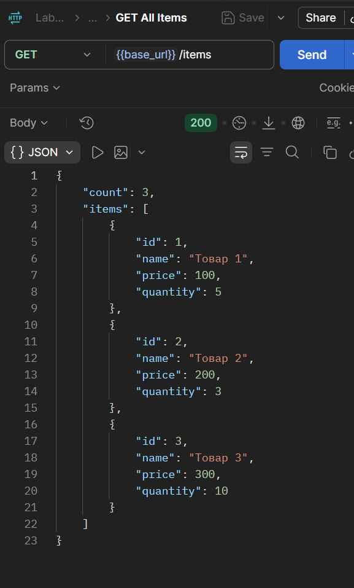

## 4.3. Получение элемента по ID

Эндпоинт:

```text
GET /items/:id
```

Код:

```js
app.get('/items/:id', (req, res) => {
    const id = parseInt(req.params.id);
    const item = items.find(i => i.id === id);

    if (!item) {
        return res.status(404).json({
            error: 'Элемент не найден'
        });
    }

    res.json(item);
});
```

При существующем идентификаторе возвращается соответствующий товар.

**Скриншот — GET Item by ID**

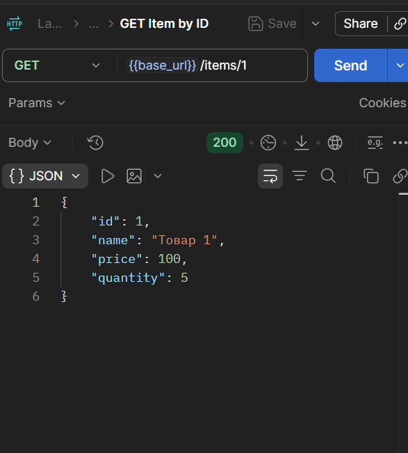

## 4.4. Создание элемента

Для создания товара используется:

```text
POST /items
```

Код:

```js
app.post('/items', (req, res) => {
    const { name, price, quantity } = req.body;

    if (!name || price === undefined) {
        return res.status(400).json({
            error: 'Поля name и price обязательны'
        });
    }

    const newItem = {
        id: nextId++,
        name: name,
        price: price,
        quantity: quantity || 0
    };

    items.push(newItem);

    res.status(201).json(newItem);
});
```

Тело запроса:

```json
{
    "name": "Новый товар",
    "price": 500,
    "quantity": 7
}
```

При успешном создании сервер возвращает `201 Created`.

**Скриншот — POST Create Item**

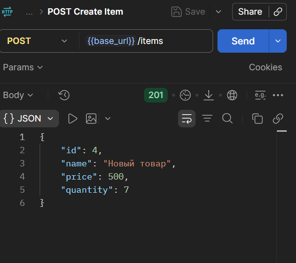

## 4.5. Обновление элемента

Для обновления используется:

```text
PUT /items/:id
```

Код:

```js
app.put('/items/:id', (req, res) => {
    const id = parseInt(req.params.id);
    const index = items.findIndex(i => i.id === id);

    if (index === -1) {
        return res.status(404).json({
            error: 'Элемент не найден'
        });
    }

    const { name, price, quantity } = req.body;

    items[index] = {
        id: id,
        name: name || items[index].name,
        price: price !== undefined ? price : items[index].price,
        quantity: quantity !== undefined ? quantity : items[index].quantity
    };

    res.json(items[index]);
});
```

**Скриншот — PUT Update Item**

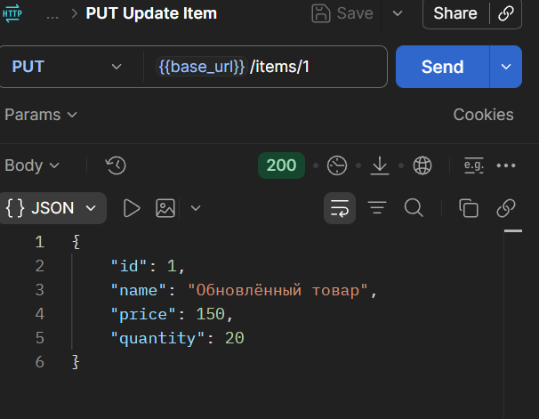

## 4.6. Удаление элемента

Для удаления используется:

```text
DELETE /items/:id
```

Код:

```js
app.delete('/items/:id', (req, res) => {
    const id = parseInt(req.params.id);
    const index = items.findIndex(i => i.id === id);

    if (index === -1) {
        return res.status(404).json({
            error: 'Элемент не найден'
        });
    }

    const deletedItem = items.splice(index, 1)[0];

    res.json({
        message: 'Элемент удалён',
        deleted: deletedItem
    });
});
```

После удаления сервер возвращает сообщение и данные удалённого элемента.

**Скриншот — DELETE Delete Item**

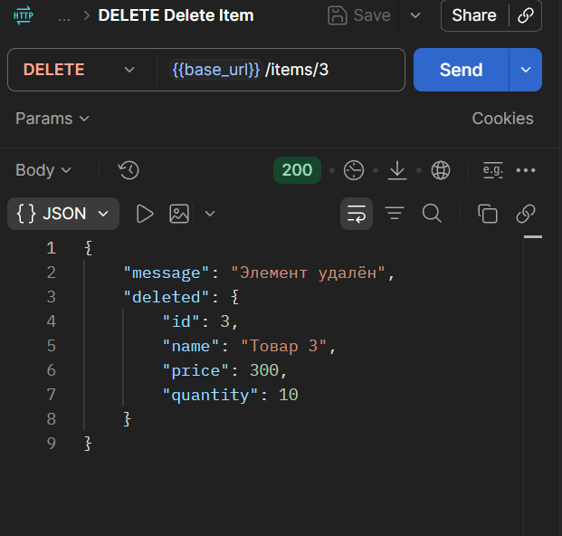

## 4.7. Обработка ошибки 400

Для проверки валидации был создан запрос `POST Invalid Data (400)`.

В теле запроса передавался пустой JSON:

```json
{}
```

Сервер возвращает:

```json
{
    "error": "Поля name и price обязательны"
}
```

Статус ответа:

```text
400 Bad Request
```

**Скриншот — POST Invalid Data (400)**

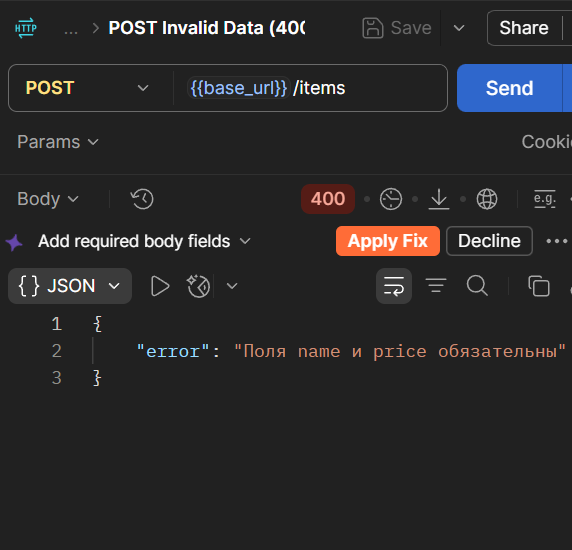

---

# 5. Настройка Postman

Для тестирования API была создана коллекция:

```text
Lab2 CRUD API
```

В коллекции была создана папка:

```text
Items
```

Для хранения адреса сервера создано окружение:

```text
Local Development
```

Переменная окружения:

```text
base_url = http://localhost:3000
```

В запросах используется переменная:

```text
{{base_url}}
```

Например:

```text
{{base_url}}/items
```

---

# 6. Автоматическое тестирование

Для проверки ответов API были добавлены автоматические тесты Postman.

Пример тестов для получения списка товаров:

```js
pm.test("Статус 200 OK", function () {
    pm.response.to.have.status(200);
});

pm.test("Ответ в формате JSON", function () {
    pm.response.to.be.json;
});

pm.test("Есть поле count", function () {
    const jsonData = pm.response.json();
    pm.expect(jsonData).to.have.property('count');
});

pm.test("items - это массив", function () {
    const jsonData = pm.response.json();
    pm.expect(jsonData.items).to.be.an('array');
});
```

Для POST-запросов проверяется статус `201 Created` и наличие идентификатора созданного ресурса.

Для ошибочных запросов проверяется статус `400 Bad Request` и наличие поля `error`.

---

# 7. Индивидуальное задание — вариант 7

Согласно варианту 7 необходимо реализовать API для сущности **«Города»**.

Основные поля:

- `id`;
- `name`;
- `population`.

Дополнительные поля:

- `country`;
- `area`.

Также реализованы:

- поиск по названию;
- сортировка по населению;
- пагинация;
- валидация входных данных;
- CRUD-операции.

---

# 8. Хранение городов

Для хранения городов создан массив:

```js
let cities = [
    {
        id: 1,
        name: 'Москва',
        population: 13000000,
        country: 'Россия',
        area: 2561
    },
    {
        id: 2,
        name: 'Грозный',
        population: 330000,
        country: 'Россия',
        area: 324
    },
    {
        id: 3,
        name: 'Санкт-Петербург',
        population: 5600000,
        country: 'Россия',
        area: 1439
    }
];

let nextCityId = 4;
```

---

# 9. GET /cities

Для получения списка городов используется:

```text
GET /cities
```

Код:

```js
app.get('/cities', (req, res) => {
    const page = parseInt(req.query.page) || 1;
    const limit = parseInt(req.query.limit) || 10;
    const start = (page - 1) * limit;
    const result = cities.slice(start, start + limit);

    res.json({
        page,
        limit,
        total: cities.length,
        cities: result
    });
});
```

Эндпоинт поддерживает пагинацию с помощью параметров `page` и `limit`.

Пример:

```text
GET /cities?page=1&limit=2
```

**Скриншот — GET All Cities**

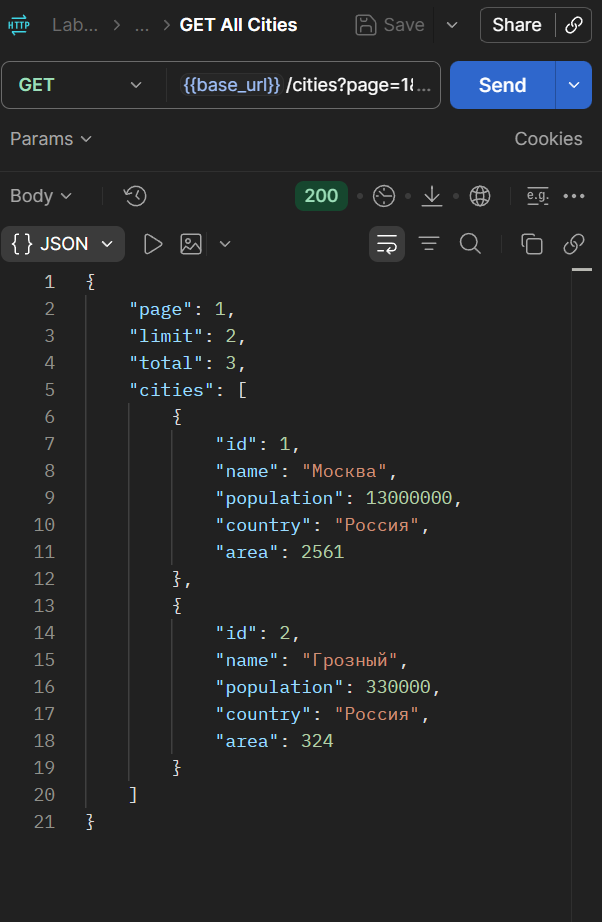

---

# 10. GET /cities/:id

Для получения одного города используется:

```text
GET /cities/1
```

Код:

```js
app.get('/cities/:id', (req, res) => {
    const id = parseInt(req.params.id);
    const city = cities.find(c => c.id === id);

    if (!city) {
        return res.status(404).json({
            error: 'Город не найден'
        });
    }

    res.json(city);
});
```

При существующем ID сервер возвращает данные города.

**Скриншот — GET City by ID**

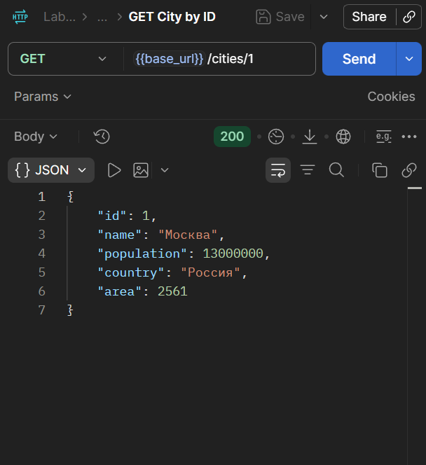

---

# 11. POST /cities

Для создания нового города используется:

```text
POST /cities
```

Код:

```js
app.post('/cities', (req, res) => {
    const { name, population, country, area } = req.body;

    if (!name || population === undefined) {
        return res.status(400).json({
            error: 'Поля name и population обязательны'
        });
    }

    if (typeof population !== 'number' || population < 0) {
        return res.status(400).json({
            error: 'population должно быть неотрицательным числом'
        });
    }

    if (area !== undefined && (typeof area !== 'number' || area < 0)) {
        return res.status(400).json({
            error: 'area должно быть неотрицательным числом'
        });
    }

    const newCity = {
        id: nextCityId++,
        name: name,
        population: population,
        country: country || '',
        area: area || 0
    };

    cities.push(newCity);

    res.status(201).json(newCity);
});
```

Пример тела запроса:

```json
{
    "name": "Владикавказ",
    "population": 320000,
    "country": "Россия",
    "area": 291
}
```

Результат:

```text
201 Created
```

**Скриншот — POST Create City**

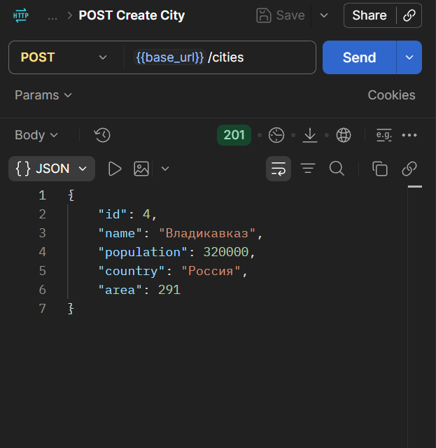

---

# 12. PUT /cities/:id

Для обновления города используется:

```text
PUT /cities/4
```

Код:

```js
app.put('/cities/:id', (req, res) => {
    const id = parseInt(req.params.id);
    const index = cities.findIndex(c => c.id === id);

    if (index === -1) {
        return res.status(404).json({
            error: 'Город не найден'
        });
    }

    const { name, population, country, area } = req.body;

    if (
        population !== undefined &&
        (typeof population !== 'number' || population < 0)
    ) {
        return res.status(400).json({
            error: 'population должно быть неотрицательным числом'
        });
    }

    if (
        area !== undefined &&
        (typeof area !== 'number' || area < 0)
    ) {
        return res.status(400).json({
            error: 'area должно быть неотрицательным числом'
        });
    }

    cities[index] = {
        id: id,
        name: name || cities[index].name,
        population:
            population !== undefined
                ? population
                : cities[index].population,
        country:
            country !== undefined
                ? country
                : cities[index].country,
        area:
            area !== undefined
                ? area
                : cities[index].area
    };

    res.json(cities[index]);
});
```

Пример тела запроса:

```json
{
    "name": "Владикавказ обновлённый",
    "population": 325000,
    "country": "Россия",
    "area": 295
}
```

**Скриншот — PUT Update City**

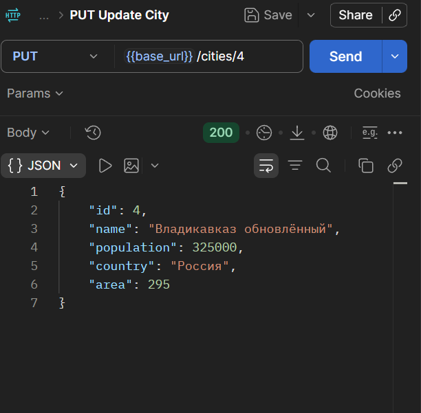

---

# 13. DELETE /cities/:id

Для удаления города используется:

```text
DELETE /cities/4
```

Код:

```js
app.delete('/cities/:id', (req, res) => {
    const id = parseInt(req.params.id);
    const index = cities.findIndex(c => c.id === id);

    if (index === -1) {
        return res.status(404).json({
            error: 'Город не найден'
        });
    }

    const deletedCity = cities.splice(index, 1)[0];

    res.json({
        message: 'Город удалён',
        deleted: deletedCity
    });
});
```

При успешном удалении возвращается сообщение и информация об удалённом городе.

**Скриншот — DELETE Delete City**

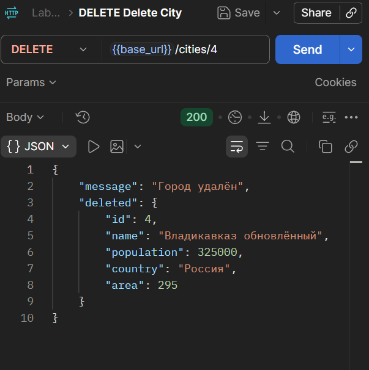

---

# 14. Поиск по названию

Для поиска города реализован эндпоинт:

```text
GET /cities/search?name=Москва
```

Код:

```js
app.get('/cities/search', (req, res) => {
    const searchName = req.query.name;

    if (!searchName) {
        return res.status(400).json({
            error: 'Параметр name обязателен'
        });
    }

    const result = cities.filter(city =>
        city.name.toLowerCase().includes(searchName.toLowerCase())
    );

    res.json({
        count: result.length,
        cities: result
    });
});
```

Поиск выполняется по названию города без учёта регистра.

**Скриншот — GET Search Cities**

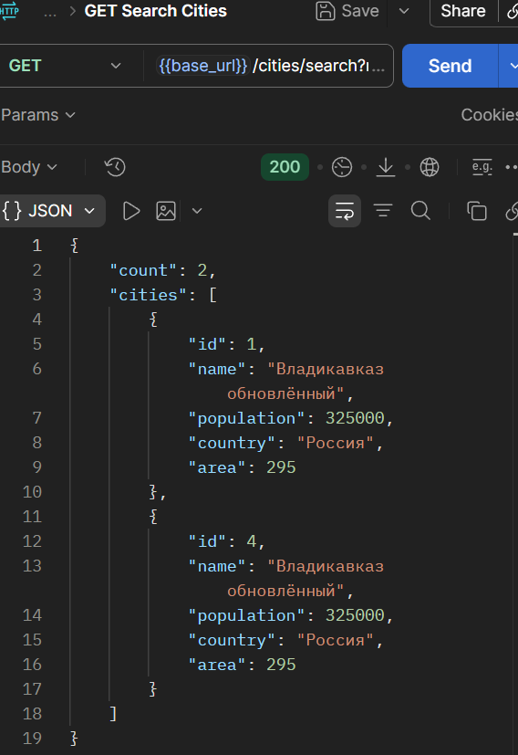

---

# 15. Сортировка городов

Для сортировки городов по населению реализован эндпоинт:

```text
GET /cities/sort?order=desc
```

Код:

```js
app.get('/cities/sort', (req, res) => {
    const order = req.query.order || 'asc';

    const sortedCities = [...cities].sort((a, b) => {
        return order === 'desc'
            ? b.population - a.population
            : a.population - b.population;
    });

    res.json({
        count: sortedCities.length,
        cities: sortedCities
    });
});
```

Значение `desc` используется для сортировки по убыванию, а `asc` — по возрастанию.

**Скриншот — GET Sort Cities**

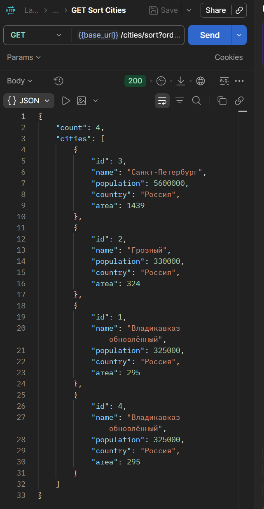

---

# 16. Пагинация

Для получения определённого количества городов используются параметры:

```text
page
limit
```

Пример:

```text
GET /cities?page=1&limit=2
```

В ответе передаются:

- номер страницы;
- количество элементов на странице;
- общее количество городов;
- массив городов текущей страницы.

Пагинация реализована в эндпоинте `GET /cities` и проверена при выполнении запроса.

---

# 17. Валидация данных

При создании и обновлении города выполняется проверка входных данных.

Поля `name` и `population` являются обязательными при создании города.

Также проверяется, что значения `population` и `area` являются числами и не являются отрицательными.

Для проверки использовался запрос:

```json
{
    "name": "Тестовый город",
    "population": -100
}
```

Сервер возвращает:

```text
400 Bad Request
```

Ответ:

```json
{
    "error": "population должно быть неотрицательным числом"
}
```

**Скриншот — POST Invalid City**

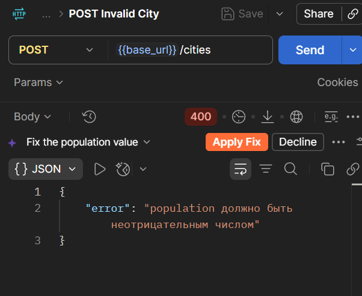

---

# 18. Автоматические тесты индивидуального задания

Для индивидуального задания были добавлены автоматические тесты Postman.

Для `GET City by ID`:

```js
pm.test("Статус 200 OK", function () {
    pm.response.to.have.status(200);
});

pm.test("Ответ содержит данные города", function () {
    const jsonData = pm.response.json();

    pm.expect(jsonData).to.have.property('id');
    pm.expect(jsonData).to.have.property('name');
    pm.expect(jsonData).to.have.property('population');
});

pm.test("ID имеет числовой тип", function () {
    const jsonData = pm.response.json();

    pm.expect(jsonData.id).to.be.a('number');
});
```

Для `POST Create City`:

```js
pm.test("Статус 201 Created", function () {
    pm.response.to.have.status(201);
});

pm.test("Ответ содержит ID", function () {
    const jsonData = pm.response.json();

    pm.expect(jsonData).to.have.property('id');
    pm.expect(jsonData.id).to.be.a('number');
});

pm.test("Ответ содержит данные города", function () {
    const jsonData = pm.response.json();

    pm.expect(jsonData).to.have.property('name');
    pm.expect(jsonData).to.have.property('population');
});
```

Для `DELETE Delete City`:

```js
pm.test("Статус 200 OK", function () {
    pm.response.to.have.status(200);
});

pm.test("Город удалён", function () {
    const jsonData = pm.response.json();

    pm.expect(jsonData).to.have.property('message');
    pm.expect(jsonData.message).to.equal('Город удалён');
});

pm.test("Ответ содержит удалённый город", function () {
    const jsonData = pm.response.json();

    pm.expect(jsonData).to.have.property('deleted');
    pm.expect(jsonData.deleted).to.have.property('id');
});
```

Для `POST Invalid City`:

```js
pm.test("Статус 400 Bad Request", function () {
    pm.response.to.have.status(400);
});

pm.test("Ответ содержит error", function () {
    const jsonData = pm.response.json();

    pm.expect(jsonData).to.have.property('error');
});
```

---

# 19. Итоговое тестирование Collection Runner

Для итоговой проверки была запущена вся коллекция `Lab2 CRUD API` с использованием окружения `Local Development`.

В коллекции было запущено 14 запросов.

Результат:

```text
All tests: 36
Passed: 36
Failed: 0
Skipped: 0
Errors: 0
Iterations: 1
Environment: Local Development
```

Все настроенные автоматические проверки завершились успешно.

**Скриншот — итоговый результат Collection Runner**

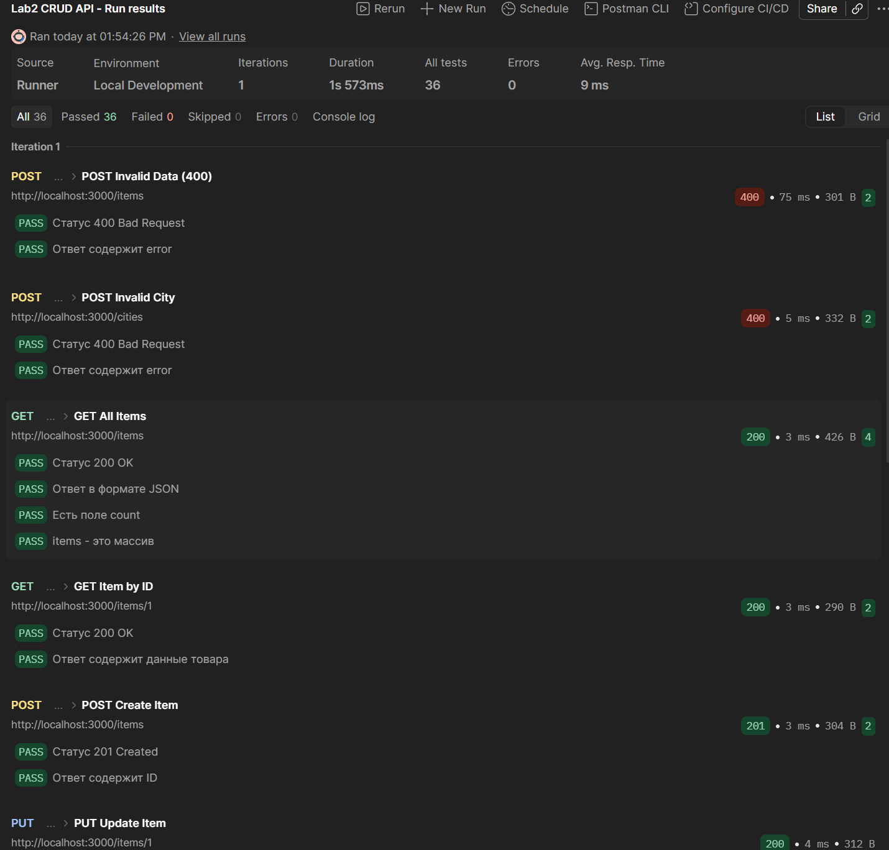

---

# 20. Контрольные вопросы

## 1. В чём разница между PUT и PATCH?

`PUT` используется для полного обновления ресурса, а `PATCH` — для частичного изменения отдельных полей ресурса.

## 2. Как реализовать поиск по коллекции?

Для поиска можно использовать query-параметр. В данной работе используется:

```text
GET /cities/search?name=Москва
```

Получить значение параметра в Express можно через:

```js
req.query.name
```

## 3. Как реализовать сортировку по полю?

Для сортировки используется метод `sort()` массива. В данной работе города сортируются по полю `population`.

## 4. Как реализовать пагинацию?

Пагинация реализуется с помощью параметров `page` и `limit`.

Начальный индекс определяется следующим образом:

```js
const start = (page - 1) * limit;
```

После этого используется метод `slice()`.

## 5. Как валидировать входные данные?

Необходимо проверить наличие обязательных полей, тип данных и допустимые значения. Например, `population` должно быть числом и не может быть отрицательным.

## 6. Какие коды ответов используются при ошибках валидации?

При некорректных входных данных используется:

```text
400 Bad Request
```

## 7. Как вернуть 204 No Content при DELETE?

Можно использовать:

```js
res.status(204).send();
```

В данной работе после удаления возвращается `200 OK` с информацией об удалённом ресурсе.

## 8. В чём разница между res.json() и res.send()?

`res.json()` используется для отправки JSON-ответа. `res.send()` может использоваться для отправки различных типов данных, например строки, HTML или объекта.

## 9. Как избежать дублирования ID?

Для генерации идентификаторов используется отдельный счётчик:

```js
let nextCityId = 4;
```

При создании города значение увеличивается:

```js
id: nextCityId++
```

## 10. Что такое express.json()?

`express.json()` — middleware Express, предназначенный для обработки JSON-данных в теле HTTP-запроса. После его подключения данные доступны через `req.body`.

---

# 21. Вывод

В ходе лабораторной работы был разработан и протестирован CRUD API на Node.js с использованием Express.

Были реализованы основные CRUD-операции:

- получение списка элементов;
- получение элемента по ID;
- создание элемента;
- обновление элемента;
- удаление элемента.

Также была реализована обработка ошибок `400` и `404`, валидация входных данных и работа с JSON.

В индивидуальной части работы, согласно варианту 7, была реализована сущность «Города» с полями `id`, `name`, `population`, а также дополнительными полями `country` и `area`.

Для городов были реализованы:

- получение списка;
- получение города по ID;
- создание;
- обновление;
- удаление;
- поиск по названию;
- сортировка по населению;
- пагинация;
- валидация входных данных.

Для тестирования API был использован Postman. Создана коллекция `Lab2 CRUD API`, настроено окружение `Local Development`, добавлены автоматические тесты и выполнен запуск Collection Runner.

В результате итогового тестирования было выполнено 36 автоматических проверок. Все 36 тестов прошли успешно, количество ошибок составило 0.

---

# 22. Список использованных источников

1. Express.js. Документация.

   https://expressjs.com/

2. Express.js. Routing.

   https://expressjs.com/en/guide/routing.html

3. Express.js API Reference.

   https://expressjs.com/en/4x/api.html

4. MDN Web Docs. HTTP request methods.

   https://developer.mozilla.org/en-US/docs/Web/HTTP/Reference/Methods

5. MDN Web Docs. HTTP response status codes.

   https://developer.mozilla.org/en-US/docs/Web/HTTP/Reference/Status

6. Postman Learning Center.

   https://learning.postman.com/

7. Методические указания к лабораторной работе №2.